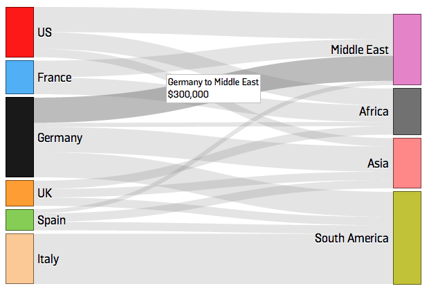

A D3 Sankey Diagram Documentation for Foreign Policy
====================
Here are the steps to produce and customize a sankey diagram using d3.js. The code was modified from <a href="https://gist.github.com/d3noob/5015397">d3noob version</a> which used d3.js and the <a href="https://github.com/d3/d3-plugins/tree/master/sankey">sankey plugin</a>. I also used <a href="https://github.com/Caged/d3-tip">d3-tip</a> from Justin Palmer to customize the mouseover tooltip.
You can view the demo chart <a href="http://kuangkeng.github.io/keng-data-journalism/sankey-demo/index.html">here</a>.

Prepare Data
====================
<ol>
 <li>Clean your data and format according to data.xls (sheet 1). Keep the wording of column header (first row) - 'source', 'target', 'value'. Double check your data. Remove data with 0 and negative value. </li>
 <li>Use a pivot table (or your own methods) to make a list of all sources and targets under the column header of 'name' (sheet 2).</li>
 <li>Pick the colors for each name, they can be same or different. Put them in the 'color' column.</li>
</ol>  

Input Data
====================
<ol>
 <li>Copy the formatted data in sheet 1 and covert them into json format using <a href="http://shancarter.github.io/mr-data-converter/">Mr Data Converter</a>. Repeat the same for sheet 2.</li>
 <li>Paste the json data into data.json. Use sheet 1 data in first part "links", and sheet 2 in second part "nodes". Nodes are the rectangular blocks in the sankey diagram and links are the flow lines that join the blocks. Make sure the syntax is correct.</li>
 <li>Before continuing with customization, you should run <a href="http://kuangkeng.github.io/sankey-diagram-demo/index.html">index.html</a> to check if the chart is appearing correctly. If it does not work, double check your data.json again. If you have a large dataset, try to copy and paste dataset into data.json in stages. This could help you detect bad data that breaks the code. However, make sure the 'name' only contains the 'source' and 'target' that you have pasted.</li>
</ol>

Customization
====================
<ol>
 <li><strong>Size of the canvas and chart:</strong> Canvas is the invisible container that houses the chart. Both can be customized in chart.js. Look for the comment with **CUSTOMIZATION.</li>
 <li><strong>Number format of 'value':</strong> Can be customized in chart.js.</li>
 <li><strong>Size of nodes and the space between nodes:</strong> Can be customized in chart.js.</li>
 <li><strong>Position and content of the mouseover tooltip of nodes and links:</strong> Can be customized in chart.js.</li>
 <li><strong>Opacity of nodes:</strong> Can be customized in style.css. Look for the comment with **CUSTOMIZATION.</li>
 <li><strong>Font beside nodes:</strong> Can be customized in style.css.</li>
 <li><strong>Color of links:</strong> Can be customized in style.css.</li>
 <li><strong>Style of tooltip:</strong> Can be customized in style.css.</li>
 <li>The font used in the chart is Solido by <a href="http://www.foreignpolicy.com/">Foreign Policy magazine</a>. The font files are in 2 folders - 'solido-extrabold' and 'solido-medium'.</li>
</ol>  

